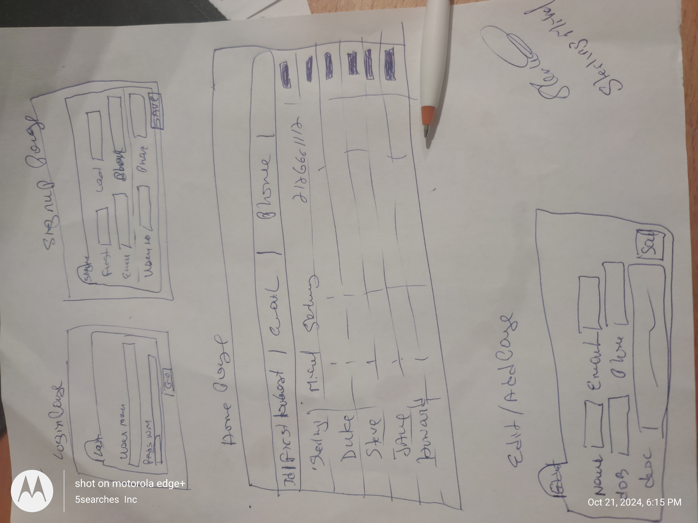
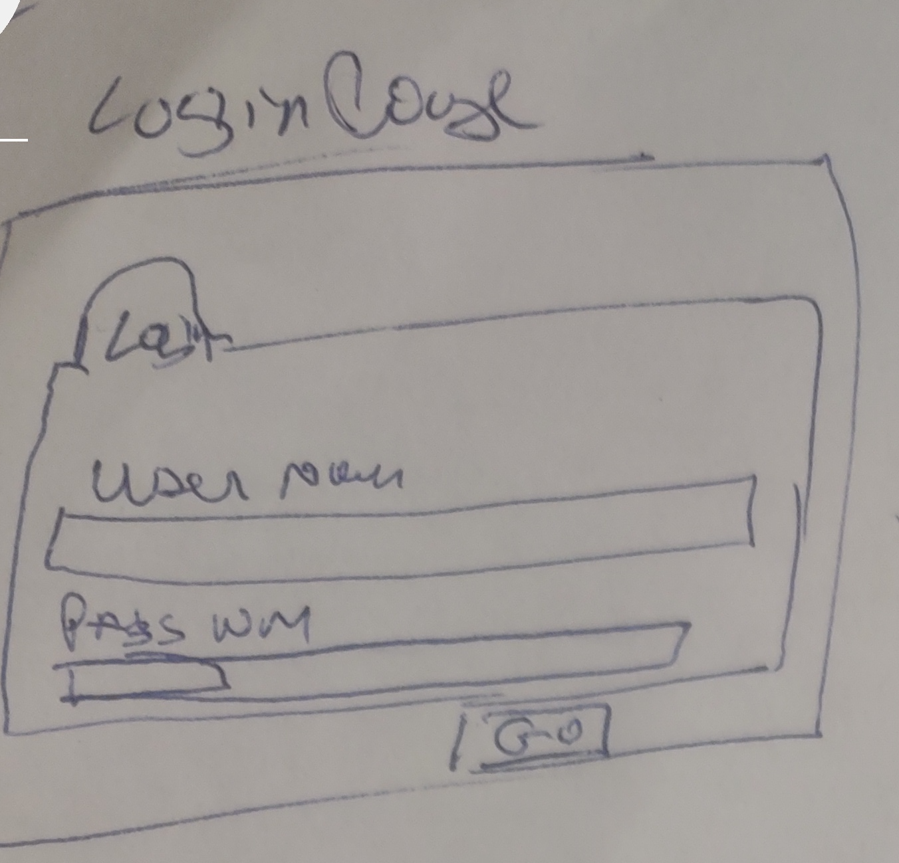
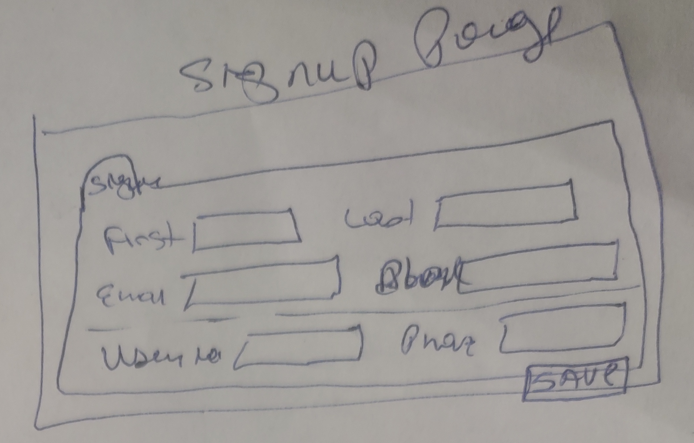

# Page Title

- Login Page
- Signup Page
- Home Page
- Edit Page
- Add Page

## Page Description (include a mockup or hand drawn image of the page)

- Login Page - It will provide the user the ability to authenticate to the application
- Signup Page - It will allow the user to become a new authorize user to the application
- Home Page - It will be the main page that will display a list of contact information
- Edit/Add Page - It will allow the user to capture the new contact and edit it as well

## Parameters needed for the page

- login -> [username, password]
- signup -> [firstName, lastName, emailAddress, phoneNumber]
- home -> [None]
- add -> [firstName, lastName, emailAddress, phoneNumber]
- edit -> [firstName, lastName, emailAddress, phoneNumber]

## Data needed to render the page

- login -> /api/login
- signup -> /api/signup
- home -> /api/contact/list
- add -> /api/contact/add
- edit -> /api/contact/edit

## Link destinations for the page

- /login
- /signup
- /home
- /edit
- /add

## List of tests for verifying the rendering of the page

- Login Test [login_test]
- Signup Test [signup_test]
- Home Test [home_test]
- Add Test [add_test]
- Edit Test [edit_test]
- View Test [view_test]

## Wireframe design

## Login Page

## Signup Page

## Home Page

## Edit or Add page

